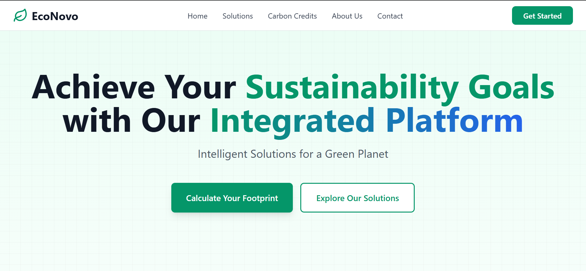
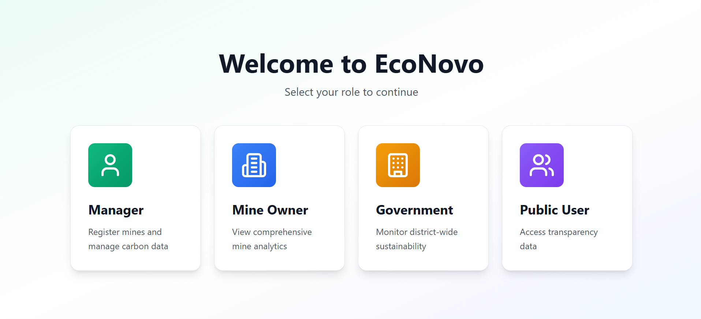
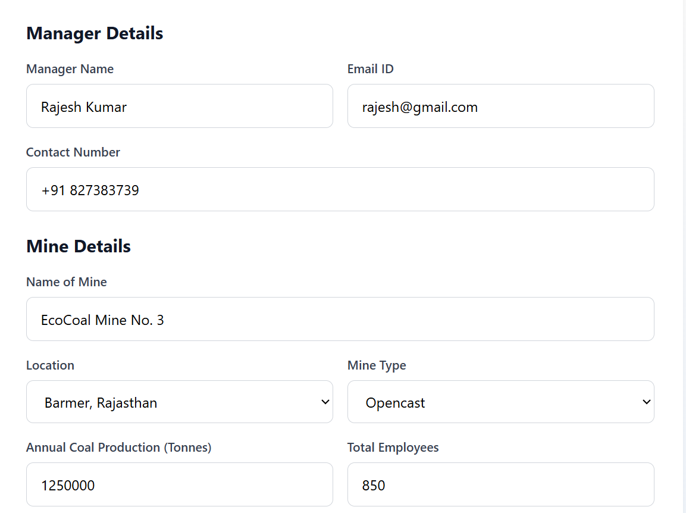
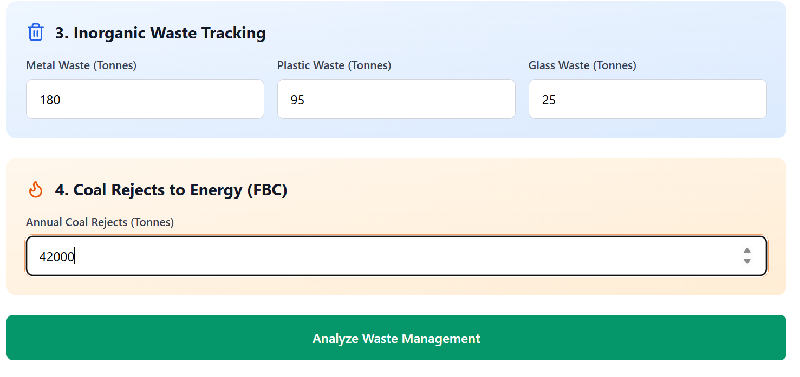
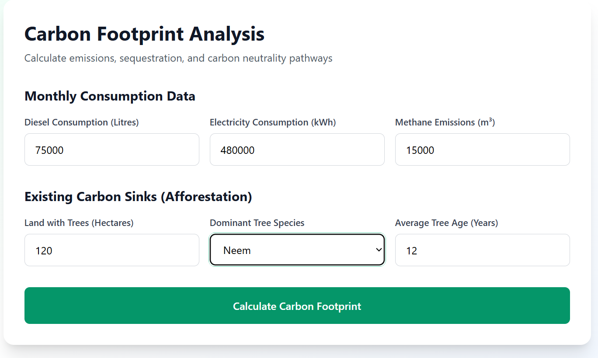
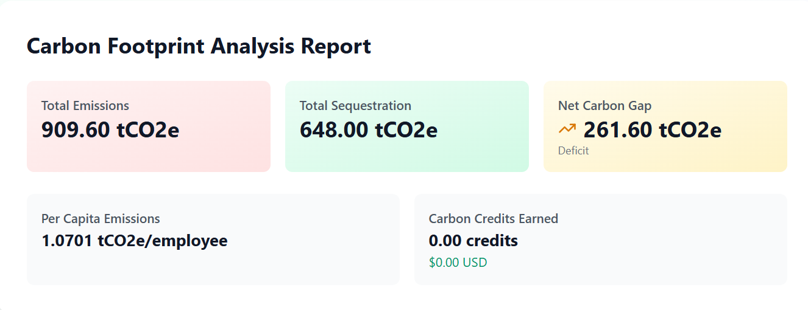
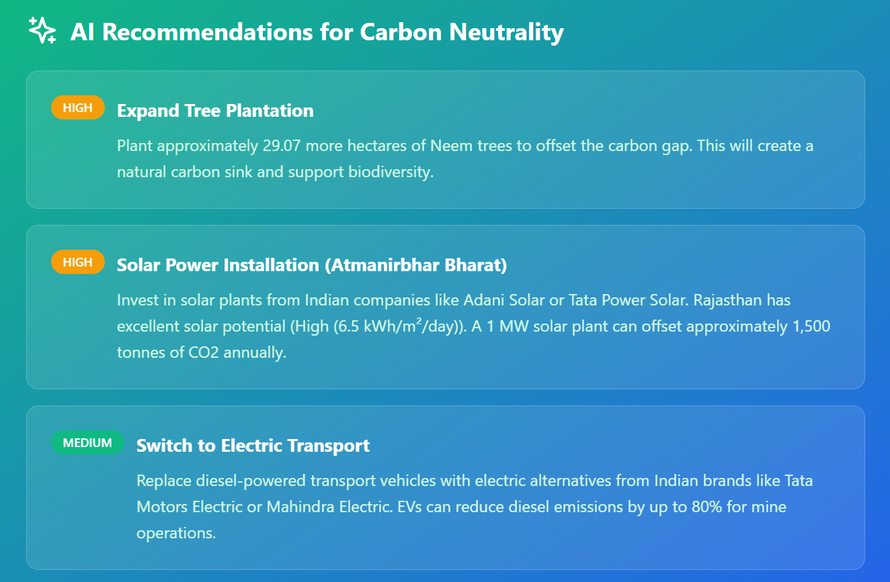
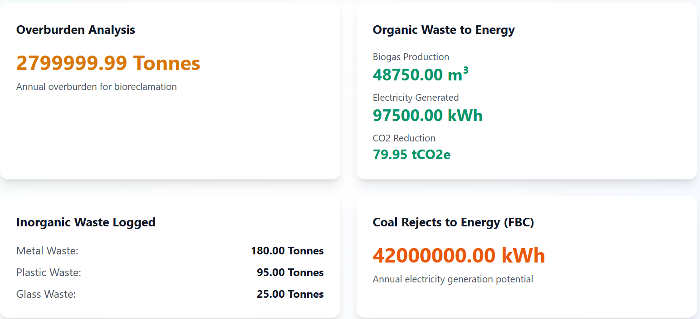
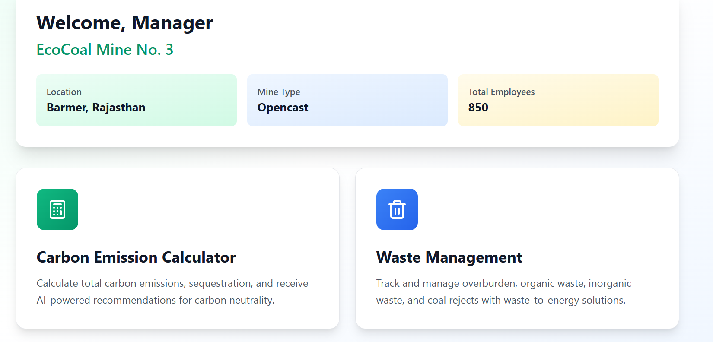

# 🌱 Carbon Emission Management System


A full-stack sustainability management platform designed for mining operations to monitor carbon emissions, analyze environmental impact, manage waste, and generate AI-powered recommendations for achieving carbon neutrality.

---

## 🚀 Live Demo

🔗 **Website:** https://carbon-emission-management-system.vercel.app

🔗 **GitHub Repository:** https://github.com/ShreyaJaincodes/carbon-emission-management-system

---

## 📖 Overview

The Carbon Emission Management System helps mining organizations monitor their environmental footprint through an intuitive dashboard. The platform enables users to register mines, calculate carbon emissions, analyze waste generation, estimate carbon sequestration, and receive intelligent recommendations to improve sustainability.

This project demonstrates full-stack web development skills, data analysis, responsive UI design, and environmental sustainability concepts.

---

## ✨ Key Features

* 🏭 Mine Registration & Management
* 🌍 Carbon Footprint Calculator
* 📊 Carbon Emission Analysis Report
* 🌳 Carbon Sequestration Estimation
* ♻️ Waste Management Analytics
* 🤖 AI-Based Sustainability Recommendations
* 📈 Carbon Credit Estimation
* 📱 Responsive User Interface
* ⚡ Fast Performance with Vite

---

## 🛠️ Tech Stack

| Technology   | Purpose            |
| ------------ | ------------------ |
| React.js     | Frontend Framework |
| TypeScript   | Type Safety        |
| Tailwind CSS | Styling            |
| Supabase     | Backend & Database |
| Vite         | Build Tool         |
| Vercel       | Deployment         |

---

# 📸 Project Screenshots

## 🏠 Home Page



---

## 📝 Mine Registration



---

## 👨‍💼 Manager Registration



---

## 🏭 Mine Information



---

## 🌍 Carbon Footprint Analysis



---

## 📊 Carbon Footprint Report



---

## 🤖 AI Recommendations



---

## ♻️ Waste Management Analysis



---

## 📈 Additional Dashboard



---

## ⚙️ Installation

Clone the repository:

```bash
git clone https://github.com/ShreyaJaincodes/carbon-emission-management-system.git
```

Move into the project directory:

```bash
cd carbon-emission-management-system
```

Install dependencies:

```bash
npm install
```

Start the development server:

```bash
npm run dev
```

---

## 📂 Project Structure

## 📂 Project Structure

```text
carbon-emission-management-system
│
├── screenshots/
├── src/
├── supabase/
│   └── migrations/
├── .gitignore
├── package.json
├── vite.config.ts
├── tailwind.config.js
├── tsconfig.json
└── README.md
```
---

## 🔮 Future Enhancements

* User Authentication
* PDF Report Generation
* Real-Time Analytics Dashboard
* IoT Sensor Integration
* Machine Learning for Emission Prediction
* Government Compliance Reports
* Export Reports to Excel/PDF

---

## 👩‍💻 Developer

**Shreya Jain**

GitHub: https://github.com/ShreyaJaincodes

---

## ⭐ Support

If you found this project helpful, consider giving it a ⭐ on GitHub.

---

## 📄 License

This project is intended for educational and portfolio purposes.